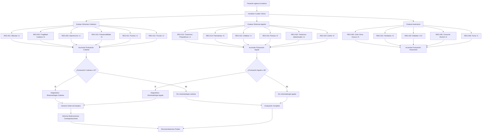
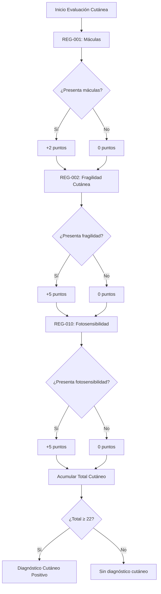
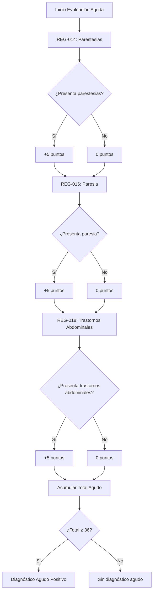
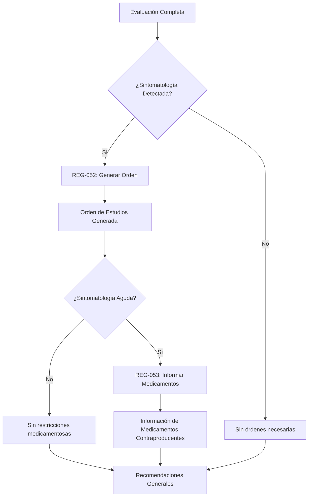
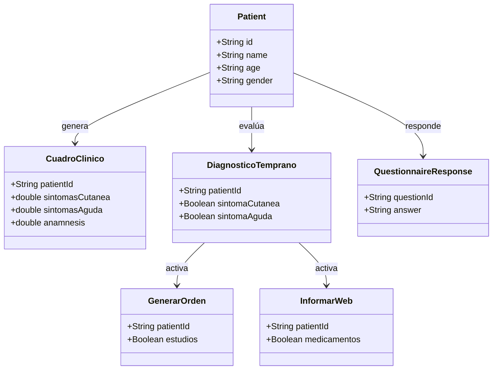

# Diagramas de Flujo del Sistema de Reglas

## Figura 6.10 - Flujo General del Sistema de Diagnóstico

## Figura 6.11 - Flujo de Reglas de Síntomas Cutáneos

## Figura 6.12 - Flujo de Reglas de Síntomas Agudos

## Figura 6.13 - Flujo de Generación de Órdenes

## Figura 6.14 - Arquitectura de Clases de Reglas

## Tabla 6.1 - Resumen de Reglas por Categoría

| Categoría | Reglas | Rango de Puntuación | Umbral Diagnóstico |
|-----------|--------|-------------------|-------------------|
| Síntomas Cutáneos | REG-001 a REG-012 | +1 a +5 puntos | ≥ 22 puntos |
| Síntomas Agudos | REG-013 a REG-029 | +2 a +5 puntos | ≥ 36 puntos |
| Anamnesis | REG-030 a REG-049 | +0.5 a +5 puntos | Acumulativo |
| Diagnóstico | REG-050 a REG-051 | Boolean | Basado en umbrales |
| Órdenes | REG-052 | Boolean | Si hay sintomatología |
| Medicamentos | REG-053 | Boolean | Si hay sintomatología aguda |

## Tabla 6.2 - Puntuaciones por Síntoma

| Síntoma | Puntuación | Categoría | Relevancia |
|---------|------------|-----------|------------|
| Fotosensibilidad | +5 | Cutánea | Alta |
| Parestesias | +5 | Aguda | Alta |
| Familiares | +5 | Anamnesis | Alta |
| Fragilidad Cutánea | +5 | Cutánea | Alta |
| Paresia | +5 | Aguda | Alta |
| Trastornos Abdominales | +5 | Aguda | Alta |
| Hipertricosis | +4 | Cutánea | Muy Alta |
| Trastornos Psiquiátricos | +4 | Aguda | Muy Alta |
| Máculas | +2 | Cutánea | Media |
| Pruritos | +2 | Cutánea | Media |
| Nódulos | +1 | Cutánea | Baja |
| Diabetes | +0.5 | Anamnesis | Muy Baja |
